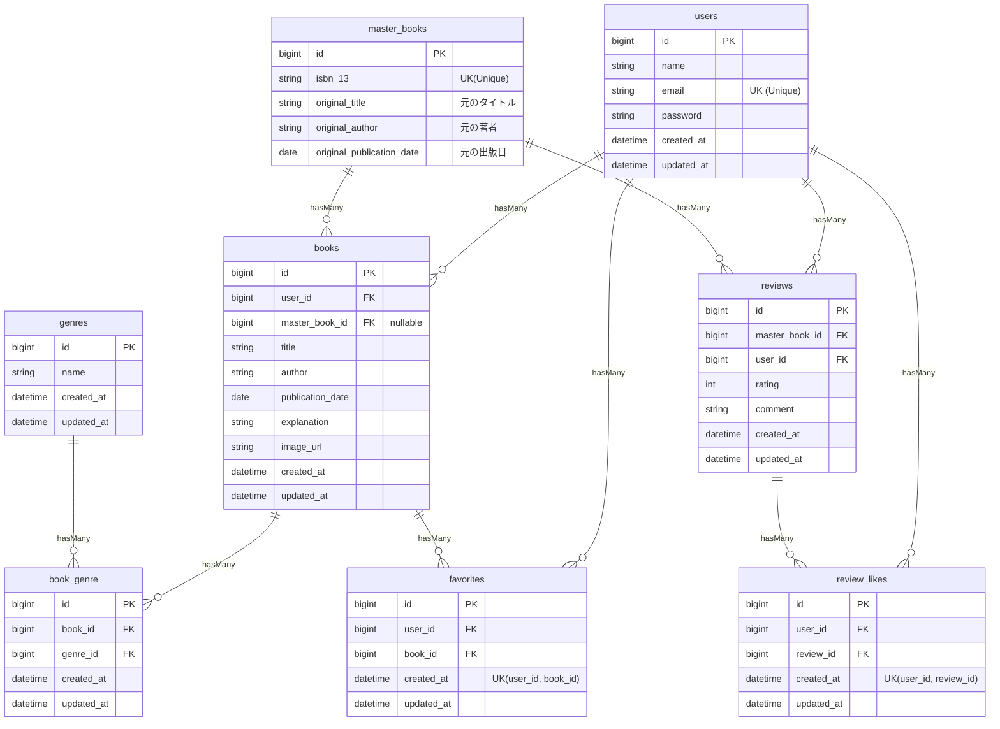

# 模擬案件:書籍レビューアプリ BookShelf

## ER図

```mermaid
    erDiagram

    users ||--o{ books : "hasMany"
    master_books ||--o{ books : "hasMany"

    books ||--o{ book_genre : "hasMany"
    genres ||--o{ book_genre : "hasMany"

    users ||--o{ reviews : "hasMany"
    master_books ||--o{ reviews : "hasMany"

    users ||--o{ review_likes : "hasMany"
    reviews ||--o{ review_likes : "hasMany"

    users ||--o{ favorites : "hasMany"
    books ||--o{ favorites : "hasMany"

    users {
        bigint id PK
        string name
        string email "UK (Unique)"
        string password
        datetime created_at
        datetime updated_at
    }

    master_books {
        bigint id PK
        string isbn_13 "UK(Unique)"
        string original_title "元のタイトル"
        string original_author "元の著者"
        date original_publication_date "元の出版日"
    }

    books {
        bigint id PK
        bigint user_id FK
        bigint master_book_id FK "nullable"
        string title
        string author
        date publication_date
        string explanation
        string image_url
        datetime created_at
        datetime updated_at
    }

    genres {
        bigint id PK
        string name
        datetime created_at
        datetime updated_at
    }

    book_genre {
        bigint id PK
        bigint book_id FK
        bigint genre_id FK
        datetime created_at
        datetime updated_at
    }

    reviews {
        bigint id PK
        bigint master_book_id FK
        bigint user_id FK
        int rating
        string comment
        datetime created_at
        datetime updated_at
    }

    review_likes {
        bigint id PK
        bigint user_id FK
        bigint review_id FK
        datetime created_at "UK(user_id, review_id)"
        datetime updated_at
    }

    favorites {
        bigint id PK
        bigint user_id FK
        bigint book_id FK
        datetime created_at "UK(user_id, book_id)"
        datetime updated_at
    }
```
